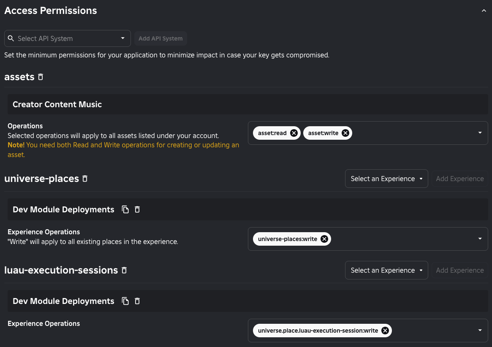

# rbxasset

# Installation

Requires [Lune](https://github.com/lune-org/lune) 0.9.3+

```sh
$ git clone https://github.com/ghostnaps/rbxasset.git
```

# Usage

Create an `rbxasset.toml` file in your project with the following content:

```toml
[assets.default]
name = "Display Name"
model = "build.rbxm"
environment = "production"
description = "Longform project description"
icon = "img/icon.png"

[environments.production]
creatorId = 35175308
creatorType = "Group"
universeId = 7854970752
placeId = 119490202754966
```

To get deployment to work properly, the following are required:
* `creatorId`: The ID of the User or Group that will own the published assets
* `creatorType`: Either `"User"` or `"Group"`. This is just to tell rbxasset how to interpret `creatorId`
* `universeId`: The `game.GameId` of an experience that will be used for Luau Execution. The experience must be owned by the asset creator
* `placeId`: The `game.PlaceId` of an experience that will be used for Luau Execution. The experience must be owned by the asset creator

## API Key

You will also need an Open Cloud API key with the following scopes:
* `asset:read` and `asset:write`
* `universe-places:write`
* `universe.place.luau-execution-session:write`

The resulting permissions should be setup similar to the following:



## Package syncing

The following example will take an rbxm file and upload it to the Creator Store using `rbxasset.toml` to define what the
display name, description, and icon will be.

```luau
-- .lune/publish.luau
local process = require("@lune/process")

local rbxasset = require("rbxasset")

local modelPath = process.args[1]
local apiKey = process.args[2]
local projectPath = process.cwd

rbxasset.publishPackageAsync(projectPath, modelPath, apiKey)
```

```sh
$ lune run publish build.rbxm <API_KEY>
```

Where `<API_KEY>` represents an Open Cloud API key with `asset:read` and `asset:write` permissions.
