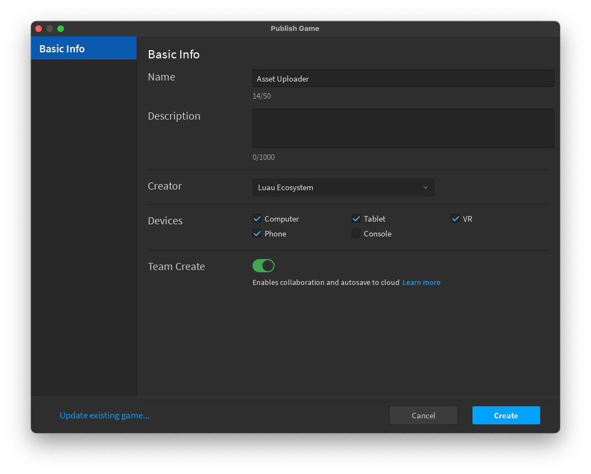
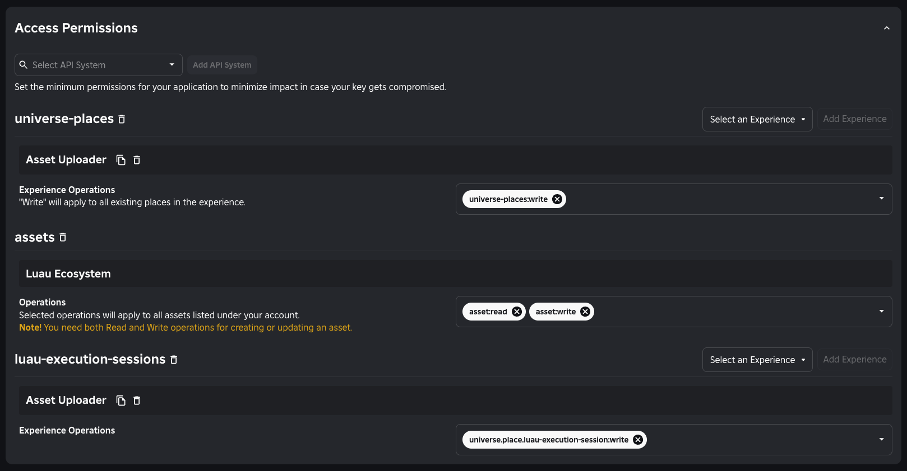

# rbxasset

# Installation

Requires [Lune](https://github.com/lune-org/lune) 0.9.3+

```sh
$ git clone https://github.com/ghostnaps/rbxasset.git
```

Then define a Luau script to use it:

```luau
local rbxasset = require("./path/to/rbxasset")
```

# Usage

Create an `rbxasset.toml` file in your project with the following content. Replace the environment configuration with values for the creator and experience to upload with.

```toml
[assets.default]
name = "Display Name"
model = "build.rbxm"
environment = "production"
description = "Longform project description"
icon = "img/icon.png"

[environments.production]
creatorId = 35175308
creatorType = "Group"
universeId = 7854970752
placeId = 119490202754966
```

This defines a `default` asset and a `production` environment to deploy to.

Then create a Luau script to handle the deployment:

```luau
-- .lune/publish.luau
local process = require("@lune/process")

local rbxasset = require("./path/to/rbxasset/src")

local apiKey = process.args[1]
assert(apiKey, "argument #1 must be a valid Open Cloud API key")

-- The rbxm file needs to be built manually. rbxasset makes no assumptions about
-- how your project is setup, it only cares about having a file to upload. Note
-- the filename `build.rbxm` matches the `model` field in rbxasset.toml
process.exec("rojo", { "build", "-o", "build.rbxm" })

-- Publish the `default` asset defined in rbxasset.toml
rbxasset.publishPackageAsync(process.cwd, "default", apiKey)
```

```sh
$ lune run publish <API_KEY>
```

Where `<API_KEY>` represents an Open Cloud API key. See below for the exact setup for the key.

## Open Cloud setup

To get this all working you will need two things: an Open Cloud API key, and an Experience to handle asset publishing.

### Asset uploader experience

Create a new Experience for the user or group that will own the asset. A fresh Baseplate named anything you like will do just fine.



Once the Experience is published, run the following from the command line:

```luau
print(game.GameId, game.PlaceId)
```

Copy both values and add them to `rbxasset.toml` for the environment's `universeId` and `placeId`, respectively.

> [!NOTE]
> In the future the hope is to not require an Experience to be created for the purpose of asset uploading. The reason this is needed right now is to close the gap of creating/updating the asset on the Creator Store via `CreateAssetAsync` and `CreateAssetVersionAsync`. If/when Open Cloud supports taking an rbxm file as input to create/update an asset, it will no longer be a requirement to setup an experience for asset uploading

### API key

An Open Cloud API key with the following scopes is required:
* `asset:read` and `asset:write`
* `universe-places:write`
* `universe.place.luau-execution-session:write`

The resulting permissions should be setup similar to the following:



# Manifest format

This section details the various fields that can be supplied for assets and environments in `rbxasset.toml`

## Assets

Assets define how the asset will be deployed and shown on the Creator Store.

| Field         | Type                    | Description                                                                                                                                                   |
| ------------- | ----------------------- | ------------------------------------------------------------------------------------------------------------------------------------------------------------- |
| `name`        | `string`                | The name of the asset on the Creator Store                                                                                                                    |
| `model`       | `string`                | Path to the rbxm to upload, relative to `rbxasset.toml`                                                                                                       |
| `environment` | `string`                | Defines which environment to deploy to. This value must equal one of the environments defined in the `environments` object                                    |
| `description` | `string?`               | The description of the asset on the Creator Store                                                                                                             |
| `icon`        | `string?`               | Path to the icon (png only) to display on the Creator Store                                                                                                   |
| `description` | `string?`               | The description of the asset on the Creator Store                                                                                                             |
| `type`        | `"Package" \| "Plugin"` | The type of asset to upload to the Creator Store. This must be set before the first publish as asset type is immutable once uploaded. Defaults to `"Package"` |

## Environments

Environments define where an asset will be deployed to. Only one environment is required, but more can be added to setup production/staging deployments.

| Field         | Type               | Description                                                                                                                 |
| ------------- | ------------------ | --------------------------------------------------------------------------------------------------------------------------- |
| `creatorId`   | `number`           | The ID of the User or Group that will own the published assets                                                              |
| `creatorType` | `"User" \| "Group` | Either `"User"` or `"Group"`. This is just to tell rbxasset how to interpret `creatorId`                                    |
| `universeId`  | `number`           | The `game.GameId` of an experience that will be used for Luau Execution. The experience must be owned by the asset creator  |
| `placeId`     | `number`           | The `game.PlaceId` of an experience that will be used for Luau Execution. The experience must be owned by the asset creator |


