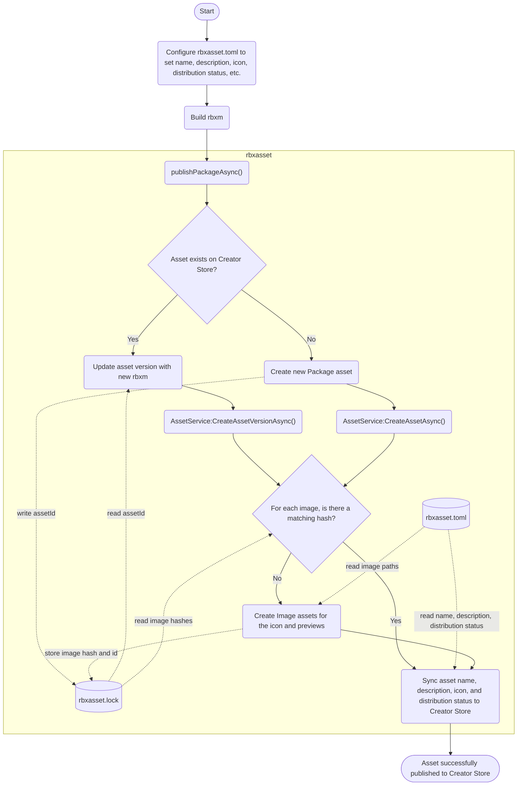

# publishPackageAsync

```mermaid
flowchart TD;
    Start([Start])
        --> Configure(Configure rbxasset.toml to set name, description, icon, distribution status, etc.)
         --> Build(Build rbxm)
         --> BeginPublishing

    subgraph rbxasset
        AssetManifest[(rbxasset.toml)]
        AssetLockfile[(rbxasset.lock)]

        BeginPublishing("publishPackageAsync()")
            --> AssetExists{Asset exists on Creator Store?}

        AssetExists -- Yes  --> UpdateVersion(Update asset version with new rbxm)
        AssetExists -- No --> CreateAsset(Create new Package asset)

        AssetLockfile -. read assetId .-> UpdateVersion

        CompareImageHashes{For each image, is there a matching hash?}
        CompareImageHashes -- Yes --> SyncAssetDetails
        CompareImageHashes -- No --> UploadImages

        AssetLockfile -. read image hashes .-> CompareImageHashes

        CreateAsset -. write assetId .-> AssetLockfile

        UploadImages(Create Image assets for the icon and previews)

        AssetManifest -. read image paths .-> UploadImages

        SyncAssetDetails(Sync asset name, description, icon, and distribution status to Creator Store)
        AssetManifest -. read name, description, distribution status .-> SyncAssetDetails

        UpdateVersion
            --> CreateAssetVersionAsync("AssetService:CreateAssetVersionAsync()")
            --> CompareImageHashes

        CreateAsset
            --> CreateAssetAsync("AssetService:CreateAssetAsync()")
            --> CompareImageHashes

        UploadImages --> SyncAssetDetails
        UploadImages -. store image hash and id .->  AssetLockfile
    end

    SyncAssetDetails
        --> CreatorStore([Asset successfully published to Creator Store])
```
